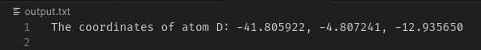

# Assignment 7 - Biomolecular Structure Interactions and Dynamics

## Objective
This assignment requires writing a program to calculate the coordinates of a fourth atom (Atom D) based on:
1. Coordinates of three initial atoms (A, B, and C).
2. Bond length between Atom C and Atom D.
3. Bond angle between the atoms B, C and D.
4. Torsion angle with respect to the given atoms.

The purpose is to apply vector calculations and transformations to predict the position of an atom in 3D space as mentioned in the Review by Ramachandran & Sasisekharan Adv. Prot. Chem. (1968) Vol. 23, given molecular geometry parameters. This code was implemented in Python.

## Getting Started

### Prerequisites
- Python 3.x
- Required libraries: `numpy`, `plotly`

To install dependencies, run:
```bash
pip install numpy plotly
```

### Input Format
Input for the program is provided via a file named `input_data.txt`, which should be located in the root directory of the project. The file format should be as follows:
```plaintext
A: x1 y1 z1
B: x2 y2 z2
C: x3 y3 z3
bond_length: <bond_length_value>
bond_angle: <bond_angle_in_degrees>
torsion_angle: <torsion_angle_in_degrees>
```

### Input Parameters (`input_data.txt`)
```plaintext
A: -42.915 -6.096 -15.152
B: -43.157 -6.618 -13.825
C: -42.633 -5.773 -12.665
bond_length: 1.3
bond_angle: 118.1
torsion_angle: -12.8
```


### Running the Program
To execute the code, run the following command:
```bash
python3 main.py -i input_data.txt
```

The program will:
1. Read the coordinates and parameters from `input_data.txt`.
2. Calculate the coordinates of Atom D.
3. Display the coordinates of Atom D in `output.txt`.
4. Generate a 3D visualization of the molecule with atoms A, B, C, and D connected by bonds.

### Output
After execution, the coordinates of Atom D will be printed to the file `output.txt` as:
```plaintext
The coordinates of atom D: -41.805922, -4.807241, -12.935650
```


A 3D ball-and-stick model of the molecule will also be displayed, visualizing the calculated structure.


## Files
- `main.py`: Main Python file containing functions for vector calculations, reading input, and generating visual output.
- `input_data.txt`: Input file for atom coordinates and molecular geometry parameters.
- `output.txt`: Output file for atom coordinates of atom D.
- `README.md`: Description of the project, usage instructions, and example input/output.
